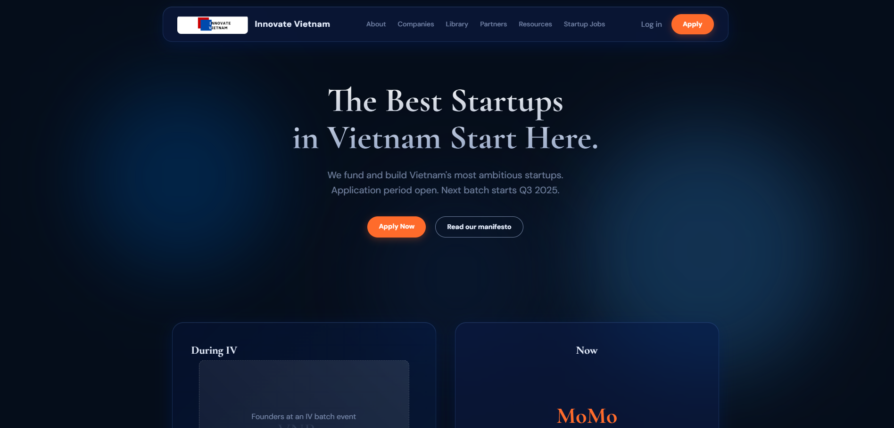
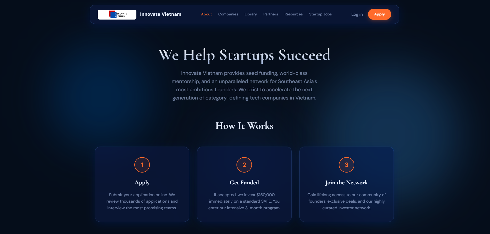
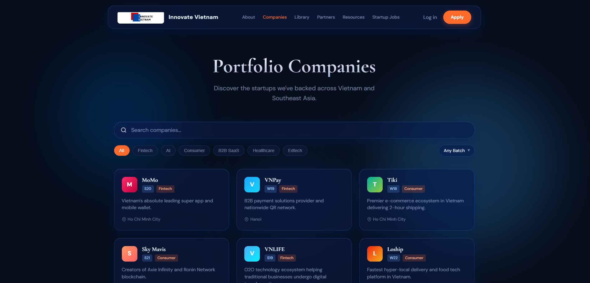
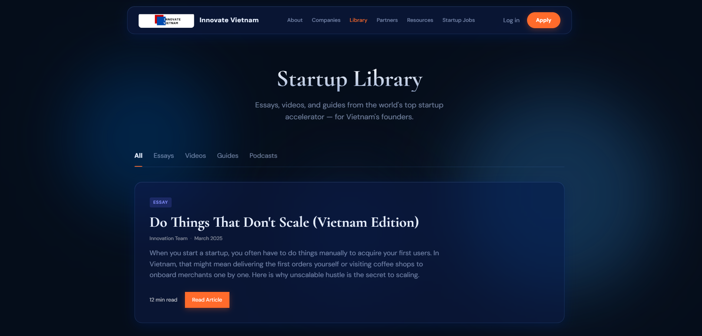
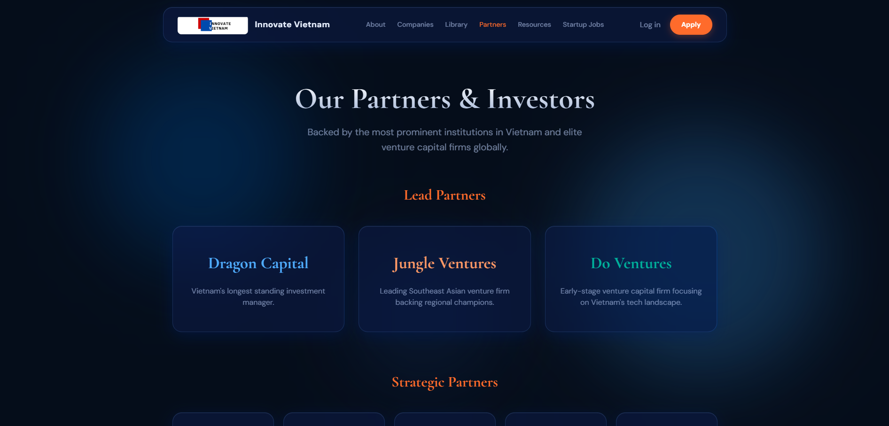
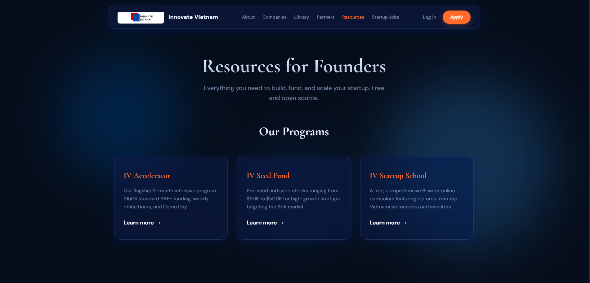
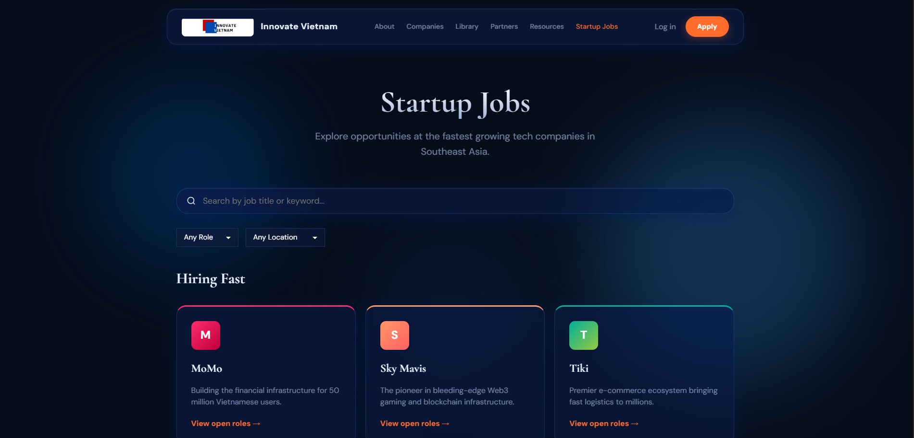
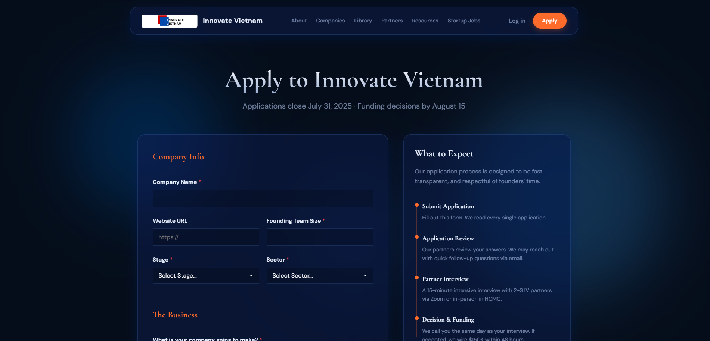

# Innovate Vietnam Landing Page

Welcome to the Innovate Vietnam website! This project is built using pure Vanilla HTML, CSS, and JavaScript. 

## 🚀 How to Run

Since this project consists of plain HTML, CSS, and JS files without any build frameworks, you can simply run it directly in your browser!

**Method 1: Direct File Opening (Easiest)**
1. Navigate to the project folder on your computer.
2. Double-click on `index.html`. 
3. It will open in your default web browser. You can navigate the site naturally by clicking the links.

**Method 2: Using VS Code Live Server (Recommended for development)**
1. Open the project folder in VS Code.
2. Install the `"Live Server"` extension (by Ritwick Dey) if you haven't already.
3. Right-click on `index.html` and select **"Open with Live Server"**.
4. The site will automatically open at `http://127.0.0.1:5500` and automatically refresh when you make code changes.

---

## 📸 Demos

*(Note: These are placeholder images for the README structure. You can easily replace them with actual screenshots of your web pages using standard screenshot tools!)*

### 1. Home Page (`index.html`)
> The sleek, animated home page with sticky glassmorphism navbar and portfolio highlights.

### 2. About Page (`about.html`)
> Learn more about the vision behind Innovate Vietnam.

### 3. Companies Portfolio (`companies.html`)
> A detailed grid view of the startups we have funded and scaled.

### 4. Library (`library.html`)
> Startup essays, guides, and essential resources for founders.

### 5. Partners (`partners.html`)
> Lead, strategic, and global venture partners in the IV network.

### 6. Resources (`resources.html`)
> Open-source playbooks, SAFE templates, and startup tools.

### 7. Jobs (`jobs.html`)
> Open positions at IV portfolio companies.

### 8. Apply (`apply.html`)
> Application form to join the next batch.

## 📂 Architecture

- `/css/`: Modularized CSS. Includes `global.css` (for variables, typography, glass utilities) and individual page styles (like `home.css`).
- `/js/`: Modularized Vanilla JavaScript. Includes `global.js` (for animations and scroll logic) and individual page scripts.
- Root directory contains all the standalone HTML pages for straight-forward browsing.
